# StockSense IMS

A full-stack inventory management system — receipts, deliveries, internal transfers, stock adjustments, and a real-time stock ledger, all in one app. Built for the Odoo Hackathon.

## Tech Stack

**Frontend**
- React 19 + TypeScript, Vite
- Tailwind CSS v4
- TanStack Query for data fetching/caching
- React Hook Form + Zod for forms and validation
- Recharts for dashboard charts
- Radix UI primitives (via a small local `ui/` component library)

**Backend**
- Node.js + Express + TypeScript
- PostgreSQL + Prisma ORM
- JWT access/refresh authentication
- Zod request validation
- Nodemailer for password-reset emails

## Features

- **Auth** — signup/login with JWT access + refresh tokens, forgot-password via emailed OTP
- **Dashboard** — key inventory KPIs, a 7-day stock movement chart, and reorder alerts
- **Products** — full CRUD, categories, units of measure, CSV import/export, barcode/QR scanner lookup
- **Operations** — Receipts, Deliveries, Internal Transfers, and Stock Adjustments, each with list + kanban views and a document detail page
- **Schedule Calendar** — month view of all scheduled pickings with overdue tracking
- **Stock & Move History** — live on-hand quantities per location, and a full ledger of every stock movement
- **Settings** — warehouses, locations, categories, and team member management with role-based access (Manager/Staff)

## Screenshots

| Login | Dashboard |
|---|---|
| 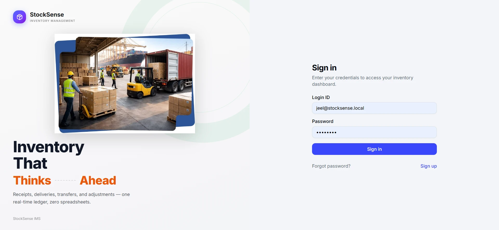 | 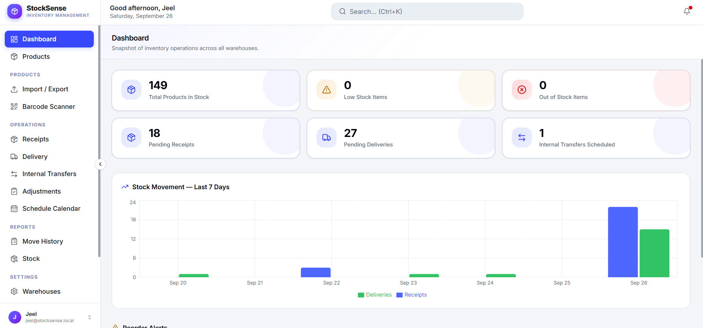 |

| Products | Import / Export |
|---|---|
| 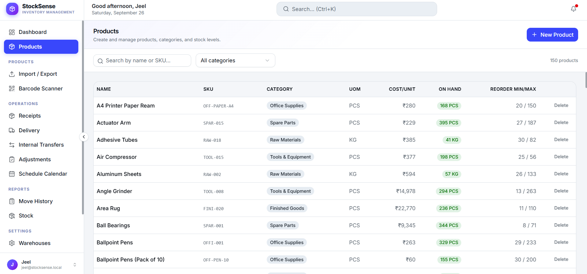 | 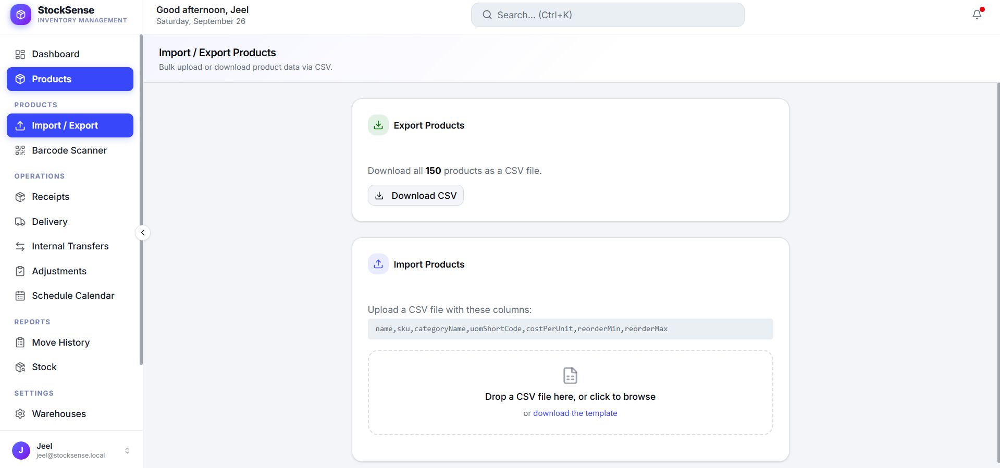 |

| Barcode / QR Scanner | Receipts |
|---|---|
| 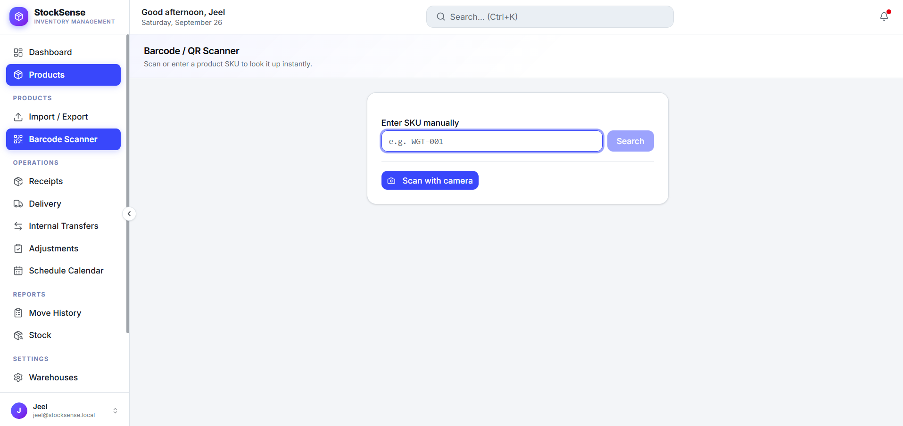 | 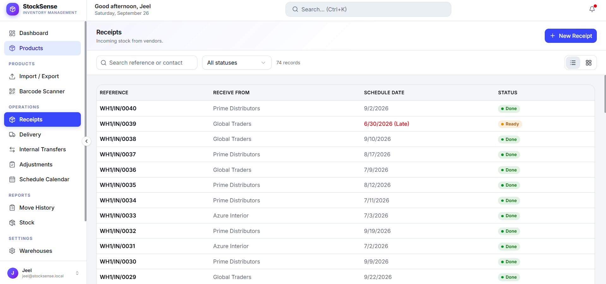 |

| Delivery (Kanban) | Internal Transfers |
|---|---|
| 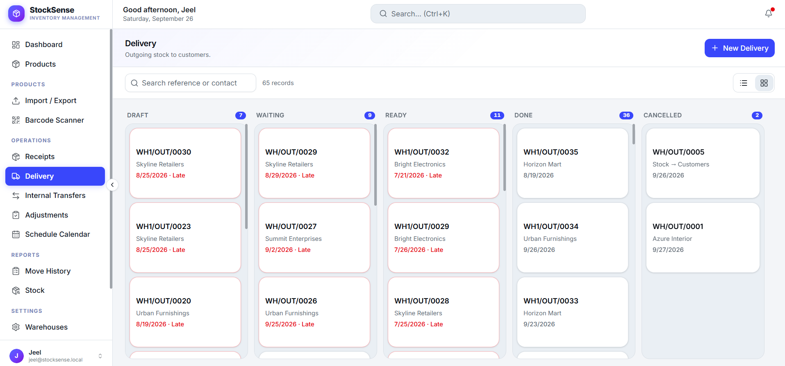 | 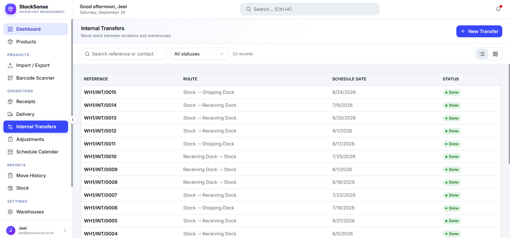 |

| Schedule Calendar | Warehouses |
|---|---|
| 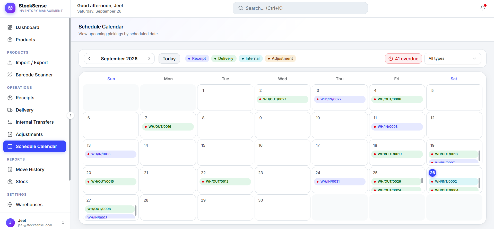 | 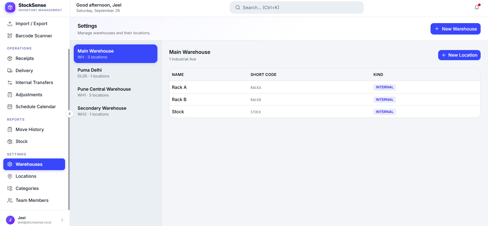 |

| Locations |
|---|
| 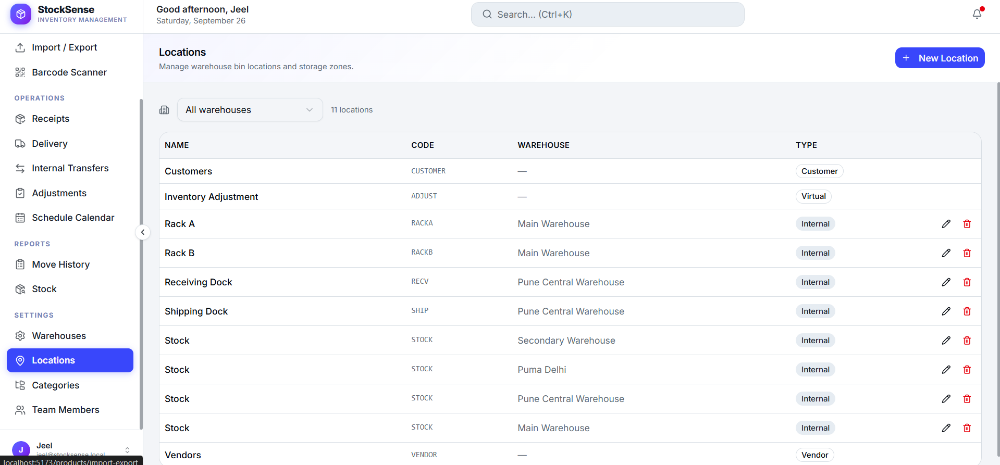 |

## Project Structure

```
odoo-StockSense/
├── backend/            Express + Prisma API
│   ├── prisma/         schema, migrations, seed scripts
│   └── src/
│       ├── modules/    one folder per domain (auth, products, pickings, stock, ...)
│       ├── middleware/ JWT auth, role guard, request validation, error handling
│       └── config/     env parsing, Prisma client
└── frontend/           React + Vite SPA
    └── src/
        ├── pages/       route-level pages, grouped by domain
        ├── components/  shared UI (layout, shared widgets, ui/ primitives)
        ├── api/         TanStack Query hooks per resource
        └── store/       auth context
```

## Getting Started

### Prerequisites

- Node.js 20+
- PostgreSQL 14+

### 1. Backend setup

```bash
cd backend
npm install
cp .env.example .env   # then fill in DATABASE_URL, JWT secrets, etc.
npm run prisma:generate
npm run prisma:migrate
npm run prisma:seed     # optional: creates demo users + sample data
npm run dev             # starts the API on http://localhost:4000
```

### 2. Frontend setup

```bash
cd frontend
npm install
npm run dev              # starts the app on http://localhost:5173
```

The Vite dev server proxies `/api` to `http://localhost:4000`, so no frontend `.env` is needed for local development.

### Demo credentials

After running `npm run prisma:seed`, you can sign in with:

| Role    | Email                        | Password      |
|---------|-------------------------------|---------------|
| Manager | `manager@stocksense.local`   | `Manager@123` |
| Staff   | `staff@stocksense.local`     | `Staff@123`   |

## Available Scripts

**Backend** (`backend/`)

| Script | Description |
|---|---|
| `npm run dev` | Start the API with hot reload |
| `npm run build` | Compile TypeScript to `dist/` |
| `npm run start` | Run the compiled build |
| `npm run prisma:migrate` | Apply database migrations |
| `npm run prisma:seed` | Seed demo users and sample data |
| `npm run prisma:seed:bulk` | Seed a larger dataset for load testing |
| `npm run prisma:studio` | Open Prisma Studio |
| `npm run lint` | Lint the backend source |

**Frontend** (`frontend/`)

| Script | Description |
|---|---|
| `npm run dev` | Start the Vite dev server |
| `npm run build` | Type-check and build for production |
| `npm run preview` | Preview the production build locally |
| `npm run lint` | Lint the frontend source |

## API Overview

All endpoints are mounted under `/api`:

| Base path | Purpose |
|---|---|
| `/api/auth` | Signup, login, refresh, forgot/reset password |
| `/api/users` | Current user profile, team member management |
| `/api/products` | Product CRUD, CSV import/export |
| `/api/categories`, `/api/uom` | Product categories and units of measure |
| `/api/warehouses`, `/api/locations` | Warehouse and location management |
| `/api/pickings` | Receipts, deliveries, transfers, and adjustments |
| `/api/moves` | Stock move ledger |
| `/api/stock` | On-hand stock quantities |
| `/api/dashboard` | KPIs, chart data, and reorder alerts |

Authentication is required on all routes except `/api/auth/*`; manager-only routes are additionally protected by a role guard.

## License

Built for the Odoo Hackathon.
